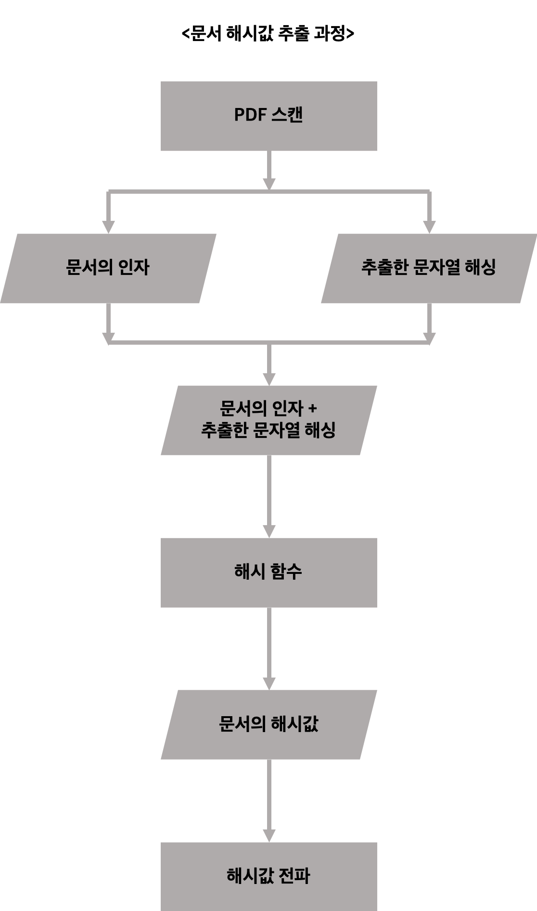
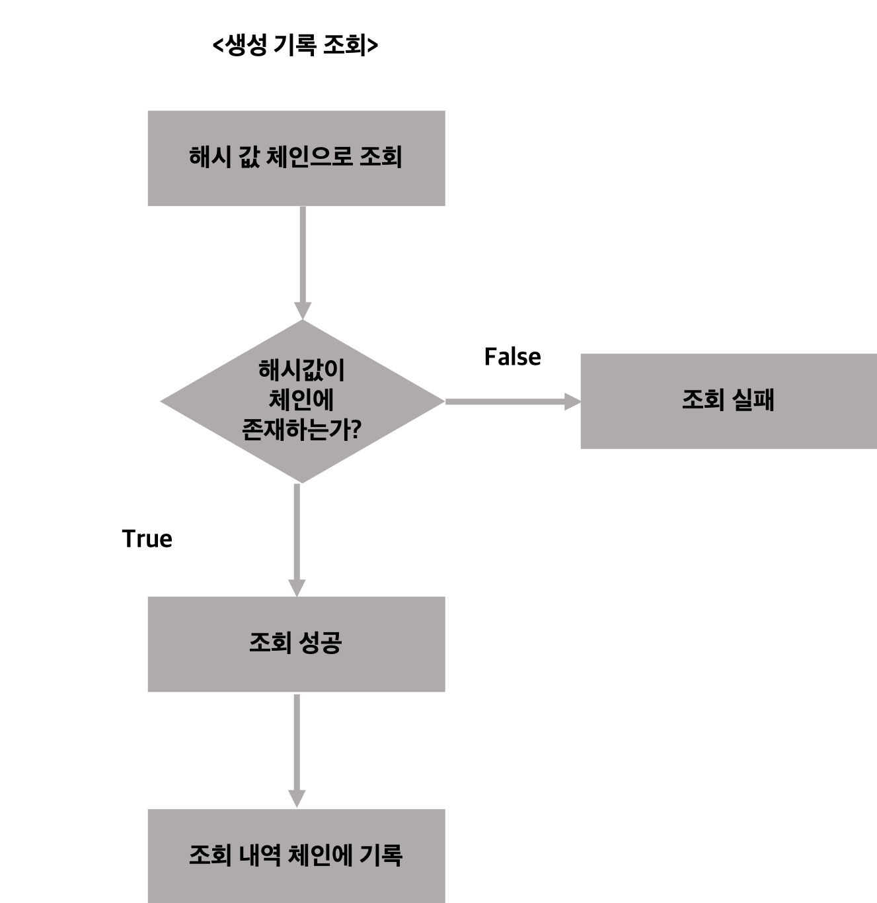
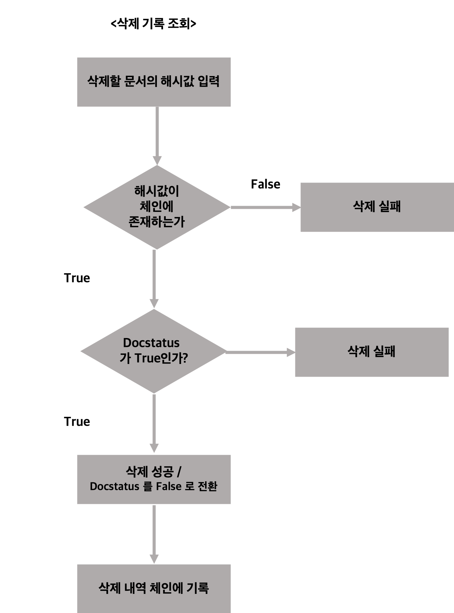
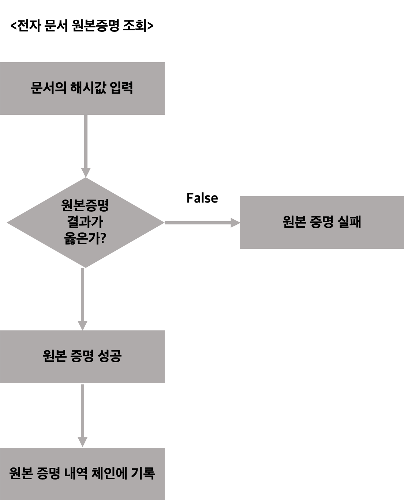
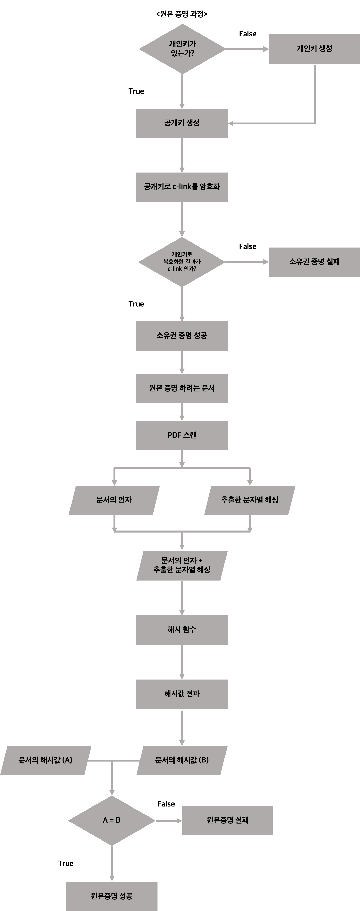
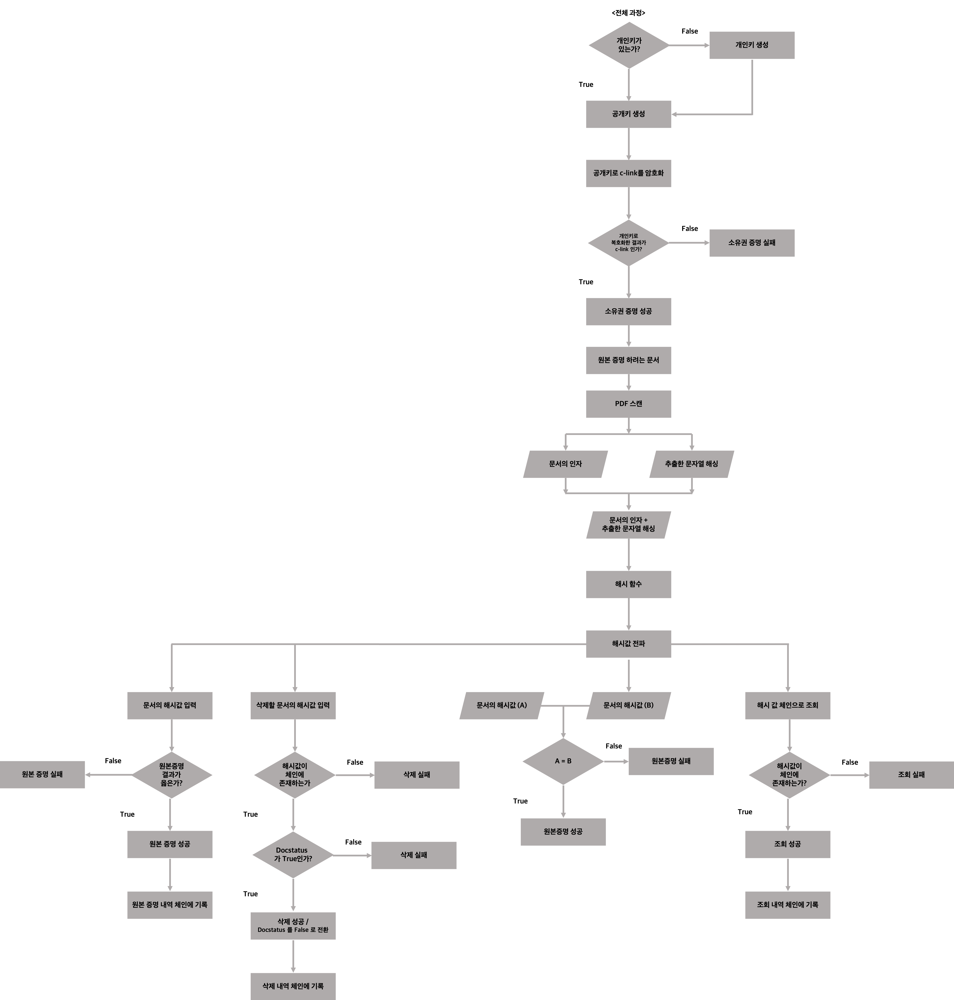

## 대학 기록물 문서등급화 씨링크 공동개발 계획 

작성자 : 박민서, 이상민, 최중현 

### 목차 

1. 정리 
2. 폴더 구성 
3. FN 003
4. FN 004 
5. FN 005
6. FN 006
7. System Architecture

### 정리 

기록물 관린 시스템은 시험지 등의 문서들을 블록체인을 이용하여 공유하는 시스템이다. 시험지 자체에 대한 내역을 모두 네트워크에 참가한 주체들이 살펴볼 수 있다는 특징이 있다. 내역이란, 보존기록(생성/삭제/원본증명)을 의미한다. 기반 블록체인은 IBM사의 Hyperledger Fabric이며, 스마트 컨트랙트는 Go-lang Chaincode로 구현하였다. 

제출물은 소스코드와 기능명세 문서 및 시스템 구조도로 이루어져있다. 

소스코드에는 주석으로 각 코드에 대한 설명이 들어있으며, 기능명세 문서는 "대학 기록물 문서등급화 씨링크 공동개발 계획"의 FN003, FN004, FN005, FN006 중 구현된 부분에 한하여 작성되었다. 시스템 구조도는 해당 코드가 구현되는 환경과 flow에 대한 설명이 포함되어있다. 

### 폴더 구성 

~~~

report.md 

source_code
    |
    |
    |----- chaincode.go
    |
    |----- dataStruct.go
    |
    |----- infoFunc.go
    |
    |----- private_key.pem

system_artchitecture.pdf

~~~

### FN003 시스템 구성

개발 환경 

~~~
ubuntu : 18.04.3

mac : macOS Catalina ver 10.15.3

node version : v 8.17.0

npm version : v 6.13.4

Hyperledger Fabric : 1.4.4 
(설치는 옆의 링크에서 진행합니다. https://hyperledger-fabric.readthedocs.io/en/release-1.4/install.html)

VisualStudio Code _ Hyperledger Fabric Extentsion

~~~

dependencies 환경 

실행하기에 5가지를 설치해야한다. node와 npm, jq, postgresql, docker 그리고 docker-compose 이다. 
특정 버전에 한해서만 지원이 되기 때문에 버전을 최대한 주어진 서류와 맞추어서 하는 것이 실행하는데 있어서 편할 것이다. 

버전 확인은 아래와 같이 하면 된다. 만약에 버전이 다르다면, 아래의 조건과 일치시킨 후에 후속작업을 실시한다.

~~~

$ which node 
/usr/local/bin/node

$ node --version
v8.11.4 or v8.17.0

$ npm --version
5.6.0 or 6.13.4

$ which jq
/usr/local/bin/jq

$ jq --version
jp-1.6

$ which postgres 
/usr/local/bin/postgres

$ postgres --version
postgres (PostgreSQL) 12.1

$ docker --version
Docker version 19.03.5, build 633a0ea

$ docker-compose --version 
docker-compose version 1.25.2, build 698e2846

~~~

다음으로는 fabric-samples의 first-network를 실행시킨다. 만약에 fabric-samples가 없다면 이 부분을 먼저 설치한다. 

코드를 실행시킬 위치에 이동하여 아래의 명령어를 입력한다. 

~~~
curl -sSL http://bit.ly/2ysbOFE | bash -s -- 1.4.4 1.4.4 0.4.18
~~~

다운로드가 완료되면 네트워크를 형성하고 시작해준다. 

~~~
cd /path/fabric-samples/first-network
./byfn.sh generate
./byfn.sh up
~~~

project 폴더를 fabric-samples/chaincode에 넣는다

~~~
docker exec -it cli bash
~~~

이후 docker cli에서 아래의 명령어를 입력한다.

~~~
#peer 설정 

export CORE_PEER_ADDRESS=peer0.org1.example.com:7051

#chaincode install
peer chaincode install -n doccc -v 1.0 -p github.com/chaincode/projectDOC
~~~

chaincode msp 설정 및 기타 설정한다. 

~~~
export CORE_PEER_LOCALMSPID=Org1MSP
export CORE_PEER_TLS_ROOTCERT_FILE=/opt/gopath/src/github.com/hyperledger/fabric/peer/crypto/peerOrganizations/org1.example.com/peers/peer0.org1.example.com/tls/ca.crt
export CORE_PEER_MSPCONFIGPATH=/opt/gopath/src/github.com/hyperledger/fabric/peer/crypto/peerOrganizations/org1.example.com/users/Admin@org1.example.com/msp
export PEER0_ORG1_CA=/opt/gopath/src/github.com/hyperledger/fabric/peer/crypto/peerOrganizations/org1.example.com/peers/peer0.org1.example.com/tls/ca.crt

export ORDERER_CA=/opt/gopath/src/github.com/hyperledger/fabric/peer/crypto/ordererOrganizations/example.com/orderers/orderer.example.com/msp/tlscacerts/tlsca.example.com-cert.pem

#instantiate
peer chaincode instantiate -o orderer.example.com:7050 --tls --cafile $ORDERER_CA -C mychannel -n doccc -v 1.0 -c '{"Args":["Init"]}'
~~~

완료 되면 아래의 기능에 따라 아래의 명령어를 실행하면 된다. 

~~~
#createDocument
peer chaincode invoke -o orderer.example.com:7050 --tls --cafile /opt/gopath/src/github.com/hyperledger/fabric/peer/crypto/ordererOrganizations/example.com/orderers/orderer.example.com/msp/tlscacerts/tlsca.example.com-cert.pem -C mychannel -n doccc -c '{"Args":["createDocument","IDstudent01","jhyun","happy@cau","c-link","student","01012345678", "hello this is DOC string", "false"]}'

#queryAllDocs
peer chaincode invoke -o orderer.example.com:7050 --tls --cafile /opt/gopath/src/github.com/hyperledger/fabric/peer/crypto/ordererOrganizations/example.com/orderers/orderer.example.com/msp/tlscacerts/tlsca.example.com-cert.pem -C mychannel -n doccc -c '{"Args":["queryAllDocs"]}'

#checkIntegrity
peer chaincode invoke -o orderer.example.com:7050 --tls --cafile /opt/gopath/src/github.com/hyperledger/fabric/peer/crypto/ordererOrganizations/example.com/orderers/orderer.example.com/msp/tlscacerts/tlsca.example.com-cert.pem -C mychannel -n doccc -c '{"Args":["checkIntegrity","DOC0001", "hello this is DOC string"]}'

#queryDoc
peer chaincode invoke -o orderer.example.com:7050 --tls --cafile /opt/gopath/src/github.com/hyperledger/fabric/peer/crypto/ordererOrganizations/example.com/orderers/orderer.example.com/msp/tlscacerts/tlsca.example.com-cert.pem -C mychannel -n doccc -c '{"Args":["queryDoc", "DOC0001"]}'

#deleteDocument
peer chaincode invoke -o orderer.example.com:7050 --tls --cafile /opt/gopath/src/github.com/hyperledger/fabric/peer/crypto/ordererOrganizations/example.com/orderers/orderer.example.com/msp/tlscacerts/tlsca.example.com-cert.pem -C mychannel -n doccc -c '{"Args":["deleteDocument", "DOC0001"]}'
~~~

이후 checkIntegrity, deleteDocument 호출로 변화된 데이터 queryAllDocs로 불러와 본다. 
~~~
peer chaincode invoke -o orderer.example.com:7050 --tls --cafile /opt/gopath/src/github.com/hyperledger/fabric/peer/crypto/ordererOrganizations/example.com/orderers/orderer.example.com/msp/tlscacerts/tlsca.example.com-cert.pem -C mychannel -n doccc -c '{"Args":["queryAllDocs"]}'
~~~

새로운 터미널에서 현재까지 생성된 블록 생성 확인할 수 있다. 
~~~
docker logs peer0.org1.example.com
~~~

Explorer는 블록체인의 현재 상황을 보여주는 역할을 한다 즉, 현재 실행되고 있는 네트워크가 필요하다. 그래서 지금까지 network 구성을 하였다. 이제부터는 explorer 부분을 설치하여보겠다. 

~~~
git clone https://github.com/hyperledger/blockchain-explorer.git
cd blockchain-explorer
~~~

다음으로는 데이터베이스를 설정한다. 

~~~
// app으로 이동 
cd blockchain-explorer/app
// explorer config.json
"postgreSQL": {
    "host": "127.0.0.1",
    "port": "5432",
    "database": "fabricexplorer",
    "username": "hppoc",
    "passwd": "password"
}
~~~

위에서 수정할 필요가 있다면, app 내의 explorerconfig.json의 일부를 수정한다. 

수정을 마친 후에는 실제로 db를 생성한다.

~~~
cd blockchain-explorer/app/persistence/fabric/postgreSQL 
chmod -R 775 db/
cd blockchain-explorer/app/persistence/fabric/postgreSQL/db/
./createdb.sh
~~~

json 파일 중 추가로 수정해야하는 부분이 있는데, 아래의 위치에 있는 json 파일에서 path를 수정하면 된다. 

~~~
/.../blockchain-explorer/app/platform/fabric/connection-profile/first-network.json
~~~

config.json을 수정하면 된다. 

~~~
/.../blockchain-explorer/app/platform/fabric/config.json
~~~

위의 주소로 이동하여 아래와 같이 수정한다. 

~~~
{
  "network-configs": {
    "network-1": {
      "version": "1.0",
      "clients": {
        "client-1": {
          "tlsEnable": true,
          "organization": "Org1MSP",
          "channel": "mychannel",
          "credentialStore": {
            "path": "./tmp/credentialStore_Org1/credential",
            "cryptoStore": {
              "path": "./tmp/credentialStore_Org1/crypto"
            }
          }
        }
      },
      "channels": {
        "mychannel": {
          "peers": {
            "peer0.org1.example.com": {}
          },
          "connection": {
            "timeout": {
              "peer": {
                "endorser": "6000",
                "eventHub": "6000",
                "eventReg": "6000"
              }
            }
          }
        }
      },
      "organizations": {
        "Org1MSP": {
          "certificateAuthorities": "fabric-ca",
          "mspid": "Org1MSP",
          "fullpath": false,
          "adminPrivateKey": {
            "path": "/tmp/fabric-samples/first-network/crypto-config/peerOrganizations/org1.example.com/users/Admin@org1.example.com/msp/keystore"
          },
          "signedCert": {
            "path": "/tmp/fabric-samples/first-network/crypto-config/peerOrganizations/org1.example.com/users/Admin@org1.example.com/msp/signcerts"
          }
        },
        "Org2MSP": {
          "certificateAuthorities": "fabric-ca",
          "mspid": "Org2MSP",
          "adminPrivateKey": {
            "path": "/tmp/fabric-samples/first-network/crypto-config/peerOrganizations/org2.example.com/users/Admin@org2.example.com/msp/keystore"
          }
        },
        "OrdererMSP": {
          "mspid": "OrdererMSP",
          "adminPrivateKey": {
            "path": "/tmp/fabric-samples/first-network/crypto-config/ordererOrganizations/example.com/users/Admin@example.com/msp/keystore"
          }
        }
      },
      "peers": {
        "peer0.org1.example.com": {
          "tlsCACerts": {
            "path": "/tmp/fabric-samples/first-network/crypto-config/peerOrganizations/org1.example.com/peers/peer0.org1.example.com/tls/ca.crt"
          },
          "url": "grpcs://localhost:7051",
          "eventUrl": "grpcs://localhost:7053",
          "grpcOptions": {
            "ssl-target-name-override": "peer0.org1.example.com"
          }
        },
        "peer1.org1.example.com": {
          "url": "grpcs://localhost:8051"
        },
        "peer0.org2.example.com": {
          "url": "grpcs://localhost:9051"
        },
        "peer1.org2.example.com": {
          "url": "grpcs://localhost:10051"
        }
      },
      "orderers": {
        "orderer.example.com": {
          "url": "grpcs://localhost:7050"
        }
      },
      "certificateAuthorities": {
        "fabric-ca": {
          "url": "http://localhost:7054",
          "httpOptions":{
            "verify": false
          },
          "registrar": {
            "enrollId": "admin",
            "enrollSecret": "adminpw"
          },
          "caName": "fabric-ca"
        }
      }
    },
    "network-2": {}
  },
  "configtxgenToolPath": "/tmp/fabric-samples/bin",
  "license": "Apache-2.0"
}
~~~

여기서 path는 모두 개발자 각각의 환경에 맞게 수정되어야 한다. 

다음으로는 build를 실행한다. 

~~~
$ cd ~/blockchain-explorer
$ npm install

$ cd ~/blockchain-explorer/app/test
$ npm install
$ npm run test

$ cd ~/blockchain-explorer/client
$ npm install
$ npm test -- -u --coverage
$ npm run build
$ serve -s build
~~~

위와 같이 build를 진행한다. 

~~~
$ cd ~/blockchain-explorer
$ ./start.sh
~~~

자 이제 back-end는 형성이 완료되었다. 
http://localhost:8080 에서 explorer가 실행되는 것을 확인할 수 있다.

### FN004 

문서는 pdf로 스캔이 되었다고 가정한다. pdf로 스캔된 문서는 고유의 해시값을 보유하게 된다. 해당 해시값를 포함한 블록이 네트워크 내의 다른 peer에게 공유된다. 

문서의 pdf가 고유의 해시값을 보유하게 되는 매커니즘은 아래와 같다. 

1. 스캔은 되었다고 가정한다. 스캔 과정에서 string도 추출되었다고 가정한다. 
2. 여기서 각 문서별 인자를 뽑아내어서 해시과정을 거친다. 인자는 시험지의 주인, 날짜 및 과목 등으로 결정된다. 이를 통하여 각 시험지별로 각기 다른 인자를 확보한다.
3. 문서마다 고유의 해시 결과값을 얻어낸다. 

해당 문서의 해시값이 처음으로 공유될 때 기록물 생성임을 알 수 있게 된다. 

문서 등록과 파기도 구현되었다. 생성과 파기는 DocMetadata의 DocStatus 따라 달라지게 설정하였다. false가 되면 파기되는 것으로 확인할 수 있다.
DocStatus는 생성될 때는 true 값을 Default로 설정하였다. 

Pdf Scan 및 String 추출 -> 해싱과정 후 해시 값 추출 -> 해당 해시값과 원본 증명하려는 문서의 string의 해시 결과값을 비교 -> true -> 원본 증명 완료 -> false -> 원본증명 실패 

### FN005 

생성 및 삭제는 FN004에서 설명한 바와 같은 절차를 거쳐서 실행된다. 문서의 생섬 및 삭제는  블록체인 상에서는 거래로 기록된다. 해당 기록에 대한 해시값을 통해 생성, 삭제 기록을 열람할 수 있다. 

원본증명에 대한 신청을 했을시에 나타나는 거래 역시 체인에 기록되기에 해당 기록에 대한 열람도 가능하다. FN 004에서 언급하였듯이, 생성 및 문서 열람 그리고 원본증명 조회에는 DocStatus는 True 값이 반환되며 삭제에 대한 조회는 False 값이 반환될 것이다. 

생성기록 조회는 조회하고자 하는 해시 값이 체인에 존재하는지를 먼저 확인한 후에, 존재하지 않는다면 실패한다. 존재한다면, 조회에 성공하고 해당 조회 내역이 체인에 기록된다. 

삭제문서 조회는 삭제할 문서의 해시값이 체인에 존재하는지를 먼저 확인한다. 없다면, 실패 있다면 해당 문서의 Docstatus가 True 인지를 확인한다. True라면, 삭제 과정을 거치고 Docstatus를 False로 전환한다. 그리고 이 삭제 내역을 체인에 기록한다. 

반면, Docstatus가 이미 False라면 삭제가 된 상태이기에 삭제에 실패한다.

원본증명 조회는 원본증명할 문서의 해시값을 입력하고 해당 해시값에 대한 원본증명 과정을 거친다. 그 과정이 옳지 않다면 원본증명 실패, 옳다면 원본증명에 성공하게 된다. 원본 증명 내역을 체인에 기록한다.

원본증명 과정은 FN006에서 볼 수 있다. 

### FN006 

특정 서류에 대한 원본 증명 요청자는 요청자가 보유한 개인키를 통해 공개키를 생성 해당 서류에 대한 소유권을 증명한다.해당 과정을 통과한 후에 본격적인 서류 열람 및 원본 증명을 실시할 수 있다. 열람 과정은 FN005에서 설명된 바와 같이 진행된다. 

원본증명 과정은 아래와 같다.

먼저 소유권을 검증한다.

소유권 검증은 개인키로 시작된다. 개인키의 존재 여부를 확인한다. 개인키가 존재하지 않는다면, 개인키를 생성 있다면 이를 기반으로 공개키를 생성한다. 그 후, 공개키를 c-link(예시 문구)로 암호화 과정을 진행한다. 

추후, 개인키로 복호화를 하였을 때, c-link가 나온다면 소유권 증명에 성공 그렇지 않다면, 소유권 증명에 실패한다. 성공하였다면, 원본 증명하려는 문서를 스캔하고 문서의 문자열 등으로 부터 해시값을 추출한다. 이를 비교하려는 해시값과 일치한다면 증명하려는 문서의 원본이 증명된 것이다. 그렇지 않다면, 원본 증명에 실패한 것이다. 

### 결론

서류는 스캔이 되고, 문자열이 추출된 상태로 가정한다. 이 추출된 문자열과 문서별 인자들을 input 값으로 한 hash 값을 계산해낸다. 해당 문서를 체인에 기록을 하게 되면, DocStatus의 Default 값인 true가 반환된다. 추후, 문서 열람, 삭제 및 원본증명 기록도 체인에 기록된다. 문서 생성, 열람 그리고 원본증명에는 DocStatus가 true 값이 반환되고 삭제 조회에는 false 값이 반환된다. 

### 부록 - 전체 과정

